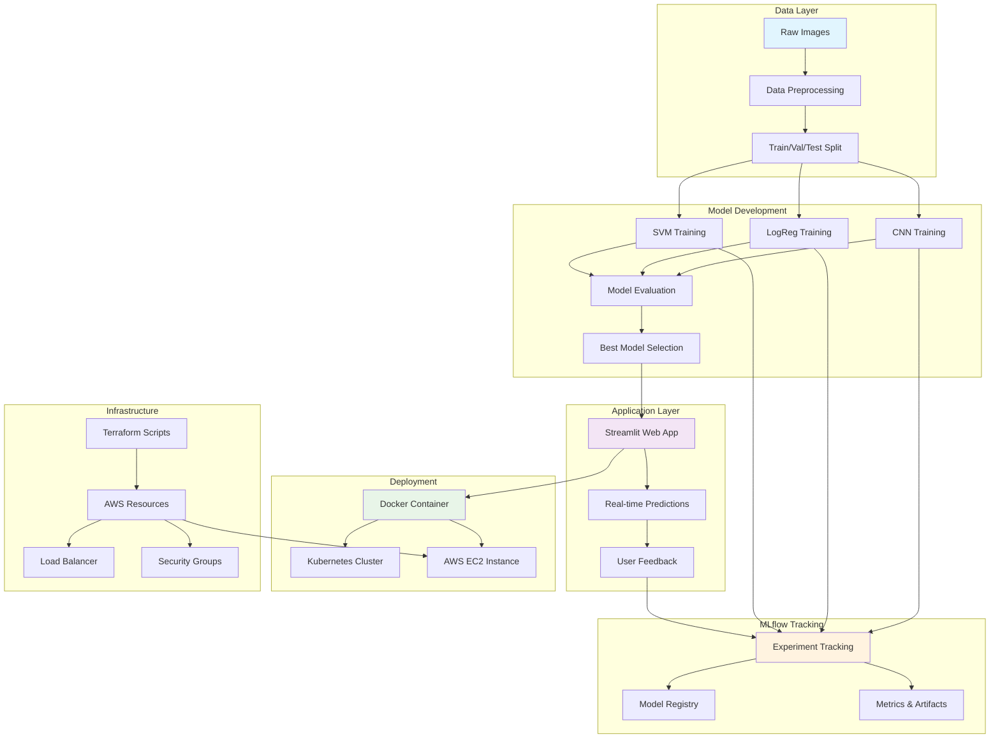
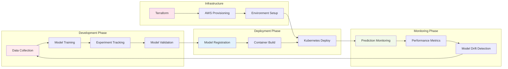
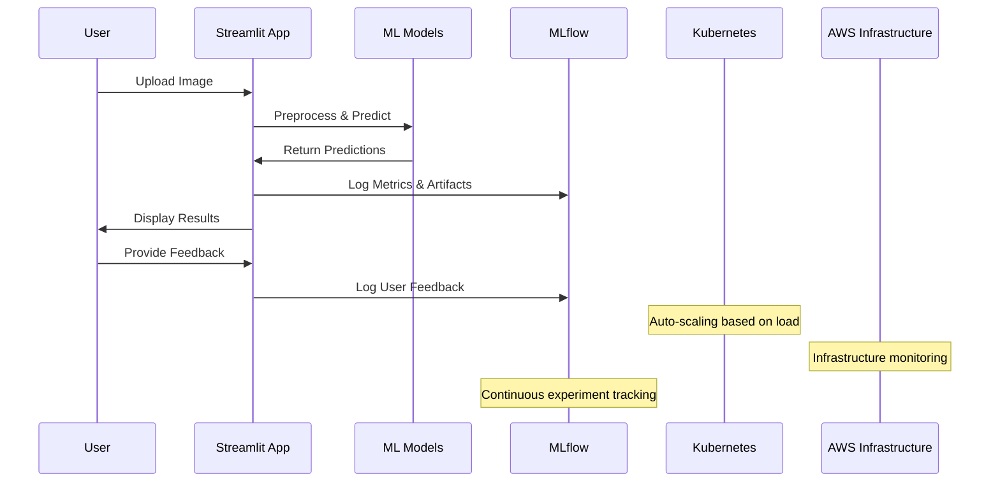

# mlops-proj
# 🍎🥦 Fruits & Vegetables Classifier - MLOps Project

<div align="center">


_A comprehensive MLOps pipeline for classifying fruits and vegetables using multiple machine learning models with experiment tracking, deployment automation, and monitoring._

</div>

## 📋 Table of Contents

- [Overview](#-overview)
- [Features](#-features)
- [Architecture](#-architecture)
- [Project Structure](#-project-structure)
- [Quick Start](#-quick-start)
- [Detailed Setup](#-detailed-setup)
- [Model Training](#-model-training)
- [Deployment](#-deployment)
- [Monitoring & Logging](#-monitoring--logging)
- [Infrastructure as Code](#-infrastructure-as-code)
- [Contributing](#-contributing)

## 🎯 Overview

This project implements a complete MLOps pipeline for classifying 36 different types of fruits and vegetables. It demonstrates industry-standard practices including:

- **Multiple ML Models**: CNN, Logistic Regression, and SVM implementations
- **Experiment Tracking**: MLflow integration for comprehensive experiment management
- **Web Application**: Interactive Streamlit interface for real-time predictions
- **Containerization**: Docker support for consistent deployments
- **Orchestration**: Kubernetes manifests for scalable deployments
- **Infrastructure**: Terraform scripts for AWS infrastructure provisioning
- **Workflow Management**: Prefect integration for pipeline orchestration

## ✨ Features

### 🤖 Machine Learning

- **3 Different Models**: CNN, Logistic Regression, and Linear SVM
- **36 Classes**: Comprehensive fruit and vegetable classification
- **Real-time Predictions**: Interactive web interface with confidence scores
- **Model Comparison**: Side-by-side performance evaluation

### 📊 MLOps Capabilities

- **Experiment Tracking**: Complete MLflow integration with metrics, parameters, and artifacts
- **Model Versioning**: Automated model versioning and registry management
- **Performance Monitoring**: Real-time prediction tracking and user feedback collection
- **Reproducibility**: Seed-based reproducible training and evaluation

### 🚀 Deployment & Infrastructure

- **Containerized Application**: Docker-ready with optimized images
- **Kubernetes Support**: Production-ready K8s manifests with scaling capabilities
- **Cloud Infrastructure**: Terraform scripts for AWS deployment
- **CI/CD Ready**: Structured for integration with CI/CD pipelines

## 🏗️ Architecture

### System Architecture Flow



### MLOps Workflow



### Component Interaction



## 📁 Project Structure

```
mlops-proj/
├── 📱 app.py                    # Streamlit web application
├── 🐳 Dockerfile              # Container configuration
├── 🧠 models.py               # Model training pipeline
├── 🔄 prefect_flow.py         # Workflow orchestration
├── 📋 requirements.txt        # Python dependencies
├── 🚀 start_mlflow_server.sh  # MLflow server startup script
├── 📊 data/                   # Dataset directory
│   └── fruits-vegetables/
│       ├── train/
│       ├── validation/
│       └── test/
├── 🎯 models/                 # Trained model artifacts
│   ├── best_cnn.pth
│   ├── best_logreg.pth
│   └── best_svm.pth
├── ☸️ k8s/                    # Kubernetes manifests
│   ├── deployment.yml
│   └── service.yml
├── 🏗️ terraform/             # Infrastructure as Code
│   ├── main.tf
│   ├── variables.tf
│   ├── outputs.tf
│   └── provider.tf
└── 📈 mlruns/                # MLflow experiment data
```

## 🚀 Quick Start

### Prerequisites

- Python 3.10+
- Docker (optional)
- Kubernetes cluster (optional)
- AWS CLI configured (for Terraform deployment)

### 1. Clone and Setup

```bash
git clone <repository-url>
cd mlops-proj

# Create virtual environment
python -m venv fv-env
source fv-env/bin/activate  # On Windows: fv-env\Scripts\activate

# Install dependencies
pip install -r requirements.txt
```

### 2. Start MLflow Server

```bash
# Start MLflow tracking server
mlflow server --backend-store-uri sqlite:///mlflow.db \
              --default-artifact-root ./mlruns \
              --host 127.0.0.1 \
              --port 5007
```

### 3. Launch Application

```bash
# Run Streamlit app
streamlit run app.py
```

🎉 **That's it!** Your application should be running at `http://localhost:8501`

## 🔧 Detailed Setup

### Environment Configuration

1. **Python Environment Setup**

   ```bash
   # Using conda
   conda create -n fruits-classifier python=3.10
   conda activate fruits-classifier
   pip install -r requirements.txt

   # Using venv
   python -m venv fv-env
   source fv-env/bin/activate
   pip install -r requirements.txt
   ```

2. **Data Preparation**

   ```bash
   # Ensure your data structure follows:
   data/fruits-vegetables/
   ├── train/
   │   ├── apple/
   │   ├── banana/
   │   └── ... (36 classes total)
   ├── validation/
   └── test/
   ```

3. **MLflow Configuration**
   ```bash
   # Set environment variables (optional)
   export MLFLOW_TRACKING_URI=http://localhost:5007
   export MLFLOW_EXPERIMENT_NAME=Fruits-Vegetables-Classification
   ```

## 🎓 Model Training

### Training Pipeline

The project includes three different models for comparison:

1. **Convolutional Neural Network (CNN)**

   - Custom architecture with 3 conv layers
   - Dropout for regularization
   - Best for image classification tasks

2. **Logistic Regression**

   - Linear model with flattened image features
   - Fast training and inference
   - Good baseline performance

3. **Support Vector Machine (SVM)**
   - Linear SVM with multi-class support
   - Robust to overfitting
   - Good performance on small datasets

### Running Training

```bash
# Train all models with MLflow tracking
python models.py

# Monitor training progress
# MLflow UI: http://localhost:5007
```

### Training Features

- **Automatic Model Saving**: Best and final models saved automatically
- **Experiment Tracking**: All hyperparameters, metrics, and artifacts logged
- **Model Comparison**: Side-by-side comparison in MLflow UI
- **Reproducibility**: Fixed random seeds for consistent results

## 🚀 Deployment

### Local Development

```bash
# Option 1: Direct Python execution
streamlit run app.py

# Option 2: Using the startup script
chmod +x start_mlflow_server.sh
./start_mlflow_server.sh
```

### Docker Deployment

```bash
# Build Docker image
docker build -t fruits-classifier:latest .

# Run container
docker run -p 8501:8501 fruits-classifier:latest

# Access application at http://localhost:8501
```

### Kubernetes Deployment

```bash
# Apply Kubernetes manifests
kubectl apply -f k8s/

# Check deployment status
kubectl get pods
kubectl get services

# For Minikube users
minikube service fruits-classifier-service
```

### Production Deployment with Terraform

```bash
cd terraform/

# Initialize Terraform
terraform init

# Plan infrastructure changes
terraform plan

# Apply infrastructure
terraform apply

# Get outputs
terraform output
```

## 📊 Monitoring & Logging

### MLflow Integration

The application provides comprehensive monitoring through MLflow:

- **Experiment Tracking**: Every model training run is tracked
- **Model Registry**: Centralized model versioning and management
- **Metrics Logging**: Training/validation metrics, inference latency
- **Artifact Storage**: Model weights, training plots, sample predictions
- **Parameter Tracking**: All hyperparameters and configuration settings

### Real-time Monitoring

- **Prediction Tracking**: Every inference logged with timestamps
- **User Feedback**: Collect and track prediction accuracy feedback
- **Performance Metrics**: Response time, confidence scores, error rates
- **Model Drift Detection**: Monitor prediction distribution changes

### Accessing Monitoring

```bash
# MLflow UI (experiment tracking)
http://localhost:5007

# Streamlit App (predictions & feedback)
http://localhost:8501
```

## 🏗️ Infrastructure as Code

### AWS Architecture

The Terraform configuration provisions:

- **EC2 Instances**: Scalable compute resources
- **Security Groups**: Network security configuration
- **Load Balancers**: High availability and traffic distribution
- **Key Pairs**: Secure SSH access
- **Auto Scaling**: Dynamic resource scaling

### Terraform Commands

```bash
# Infrastructure management
terraform init      # Initialize working directory
terraform plan      # Preview changes
terraform apply     # Apply changes
terraform destroy   # Destroy infrastructure

# State management
terraform show      # Show current state
terraform output    # Display outputs
```

### Configuration

Update `terraform/variables.tf` with your specific requirements:

```hcl
variable "instance_type" {
  default = "t2.micro"  # Adjust based on needs
}

variable "region" {
  default = "us-west-2"  # Your preferred region
}
```

## 🤝 Contributing

We welcome contributions! Please follow these steps:

1. **Fork the Repository**
2. **Create Feature Branch**: `git checkout -b feature/amazing-feature`
3. **Commit Changes**: `git commit -m 'Add amazing feature'`
4. **Push to Branch**: `git push origin feature/amazing-feature`
5. **Open Pull Request**

### Development Guidelines

- Follow PEP 8 style guidelines
- Add docstrings to all functions
- Include unit tests for new features
- Update documentation as needed
- Ensure MLflow tracking for model changes

### Code Quality

```bash
# Linting
flake8 .

# Type checking
mypy .

# Testing
pytest tests/
```

## 📄 License

This project is licensed under the MIT License - see the [LICENSE](LICENSE) file for details.

## 🙏 Acknowledgments

- **PyTorch Community** for excellent deep learning framework
- **Streamlit Team** for the amazing web app framework
- **MLflow Contributors** for comprehensive ML lifecycle management
- **Kubernetes Community** for container orchestration platform

---

<div align="center">

**⭐ Star this repository if you find it helpful!**

Made with ❤️ for the MLOps community

</div>
